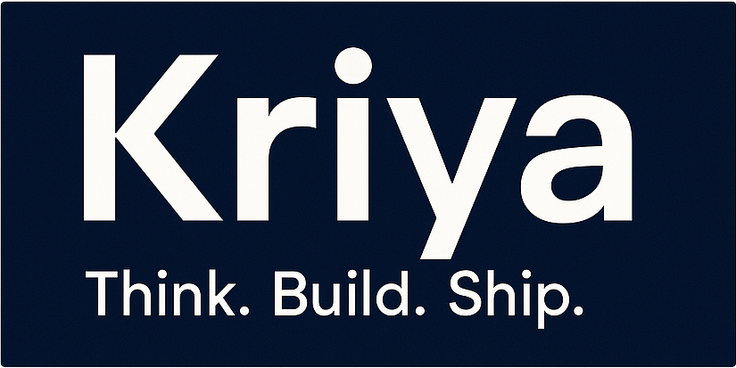
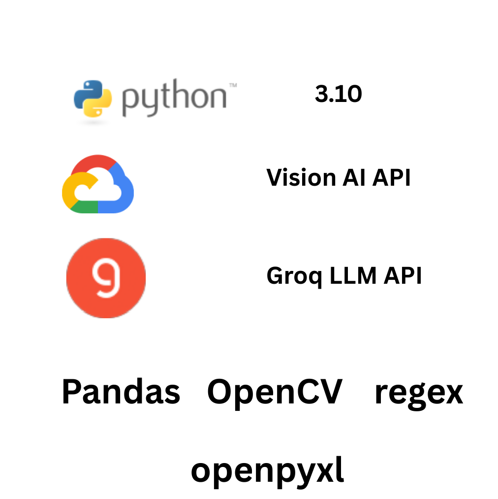

<p align="center">
  
</p>

<p align="center">
  
  
  
</p>

> **Showcase Only**  
> This repo demonstrates my architecture, process, and outcomes using safe sample assets.  
> The production code and full pipeline are proprietary and available **under NDA**.  
> To see it running live: **akar@akar7a.onmicrosoft.com**
>
> **Tags:** `ocr` · `llm` · `google-vision` · `streamlit` · `hindi` · `kannada` · `ai-showcase`

##  About Me

I’m Arindam Kar — a senior IT consultant and fractional CTO with 23+ years of experience delivering AI-backed automation systems across fintech, govtech, and startup ecosystems.

- I design and deliver real PoCs — not pitch decks
- Hands-on with AI infra, OCR, LLMs, and business process automation
- Available for PoC / Product builds, advisory, and partner roles

📧 **akar@akar7a.onmicrosoft.com**  
🔗 [LinkedIn: Arindam Kar](https://www.linkedin.com/in/arindam-kar-98085917/)  
🏢 [GitHub Org: KriyaLab](https://github.com/KriyaLab)
# OCR-Multilingual – Voter List OCR for Hindi, Kannada, and English

## Problem
In India, voter lists are often published as scanned images or PDFs in regional languages like Hindi and Kannada. Manual data entry from these documents is tedious, error-prone, and unscalable — especially when schema consistency is required for downstream analytics or government integrations.

## Solution
OCR-Multilingual is a Python-based tool that extracts structured voter data from image-based lists in **Hindi, Kannada, and English**. It ensures output is **Excel-safe**, **schema-aligned**, and **field-preserving** — supporting digitization efforts with minimal human correction.

## Key Features
- 📄 Supports Hindi, Kannada, and English voter lists
- ✅ Aligns exactly with required CSV schema
- 🧠 Combines OCR + LLM post-processing for higher accuracy
- ⚠️ Flags malformed rows for manual traceability

---

## What’s Inside (and what’s not)
- ✅ Screenshots (UI, tech stack, architecture)
- ✅ Sample input (scanned image) and output (Excel)
- ✅ Harmless sample code to demonstrate engineering style
- ✅ Three scripts available in `/src/` (structure-only, no secrets)
- ❌ No runnable pipeline in this public version
- ❌ No API keys or .env files
- ❌ No setup instructions or requirements.txt

---

## Tech Stack
- Python 3.10+
- Google Vision AI API (OCR)
- Groq API (LLM post-processing)
- Pandas, OpenCV, regex
- `openpyxl` for Excel-safe output

<p align="center">
  
</p>

---

## Architecture
```mermaid
flowchart LR
    A["Scanned Image"] --> B["OCR Engine (Google Vision API)"]
    B --> C["LLM Post-Processor (Groq API)"]
    C --> D["CSV Schema Aligner"]
    D --> E["Excel Output (openpyxl)"]
